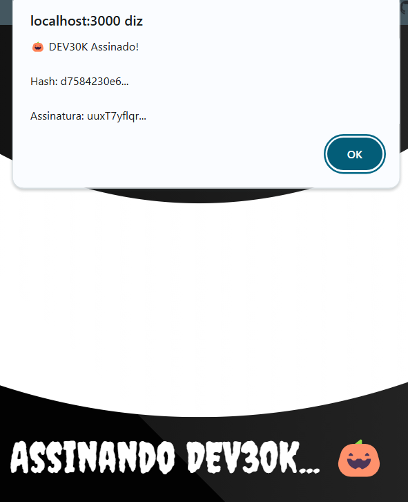
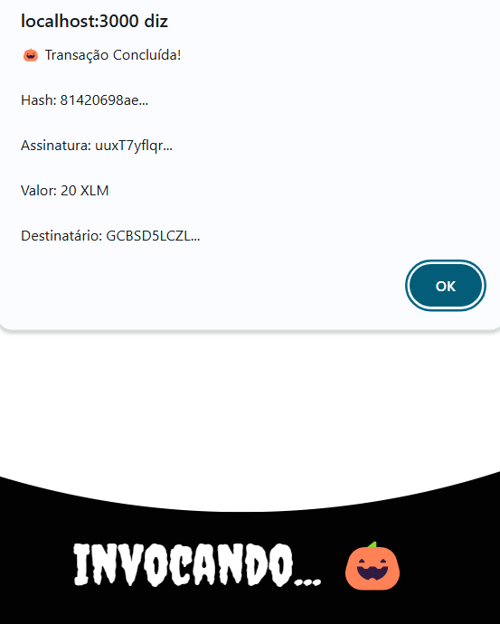

# 🎃 DEV30K - Halloween Edition

🧙‍♂️ Um projeto assustadoramente incrível desenvolvido para o Desafio DEV30K da NearX! 👻

[Demo](https://github.com/vanessabarros/dev30k-halloween) · [Relatório de Bugs](https://github.com/vanessabarros/dev30k-halloween/issues/new?assignees=&labels=bug&template=bug_report.md&title=%5BBUG%5D)

---

## 🌟 Funcionalidades

- 🔮 **Assinatura Blockchain**
  - Assine a mensagem "DEV30K" na blockchain Stellar
  - Verificação em tempo real das transações
    

- 💸 **Transferências XLM**
  - Envie XLM para qualquer carteira Stellar
  - Interface intuitiva e amigável
    

- 🎨 **Design Halloween**
  - Cores neon assustadoras
  - Animações fantasmagóricas
  - Efeitos especiais temáticos
    

## 🚀 Tecnologias

<table>
  <tr>
    <td align="center">
       
      
        <b>
          <pre>Next.js</pre>
        </b>
      
    </td>
    <td align="center">
       
      
        <b>
          <pre>TypeScript</pre>
        </b>
      
    </td>
    <td align="center">
       
      
        <b>
          <pre>Python</pre>
        </b>
      
    </td>
    <td align="center">
       
      
        <b>
          <pre>Tailwind</pre>
        </b>
      
    </td>
  </tr>
</table>

## 🎮 Quick Start

### 1. Clone o Repositório

git clone https://github.com/vanbarros76/DEV30K-Halloween.git

cd DEV30K-Halloween

### 2. Backend Setup

bash
cd backend/backend
pip install -r requirements.txt
Configure seu .env
echo "STELLAR_SECRET_KEY=sua_chave_aqui" > .env
Inicie o servidor
python -m uvicorn main:app --reload --port 8001

### 3. Frontend Setup

bash
cd frontend
npm install
npm run dev

### 4. Acesse
Abra [http://localhost:3000](http://localhost:3000) 🎃

## 📸 Screenshots

### 🦇 Tela Principal

### 🕸️ Transação

## 🎯 Endpoints API

### Stellar Endpoints

http
POST /api/stellar/

Cria uma transação e assina "DEV30K"

http
GET /api/stellar/{tx_hash}

Verifica uma transação específica

## 👻 Como Contribuir

1. Faça um Fork
2. Crie sua Feature Branch (`git checkout -b feature/AmazingFeature`)
3. Commit suas mudanças (`git commit -m '🎃 Add some AmazingFeature'`)
4. Push para a Branch (`git push origin feature/AmazingFeature`)
5. Abra um Pull Request

## 📜 Licença

Distribuído sob a licença MIT. Veja `LICENSE` para mais informações.

## 🎃 Agradecimentos

- [NearX](https://nearx.io/) pelo desafio incrível
- [Stellar](https://www.stellar.org/) pela infraestrutura blockchain
- [Framer Motion](https://www.framer.com/motion/) pelas animações
- Todos os desenvolvedores que contribuíram

---

  
🧙‍♂️ Desenvolvido com 💜 por Vanessa Barros ([LinkedIn](https://www.linkedin.com/in/vanessabarros-tech/))

